# 大语言模型部署体验实验报告

## 1. 实验内容概述

本次实验基于魔搭（`ModelScope`）平台，利用阿里云提供的免费CPU计算资源，完成了以下工作：

1. 登录魔搭平台并关联阿里云账号，获取免费计算资源；
2. 通过Jupyter Notebook环境进入项目部署环境，完成大语言模型的部署；
3. 选择3个不同的大语言模型进行问答测试，并进行横向对比分析。

所选模型：

- 通义千问 Qwen-7B-Chat
- 智谱 ChatGLM3-6B
- DeepSeek-R1-Distill-Qwen-1.5B

---

## 2. 环境部署与模型加载

### 2.1 部署环境说明

1. 激活虚拟环境：

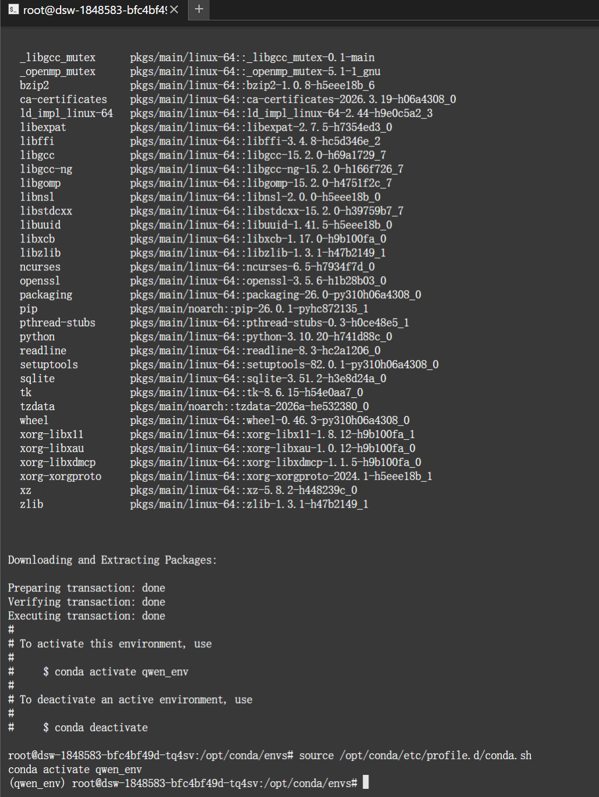

2. 安装 PyTorch：安装过程中遇到网络问题，尝试从官网及镜像网站下载均失败：

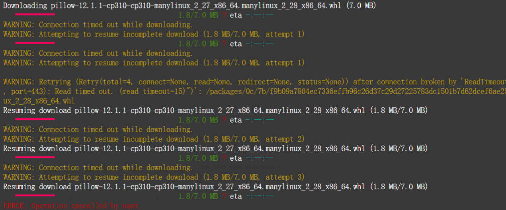

最终，通过先在镜像网站将全部依赖下载完毕，再进行安装的方式成功解决：

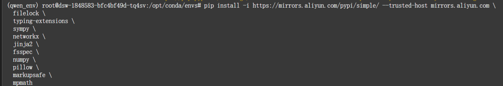

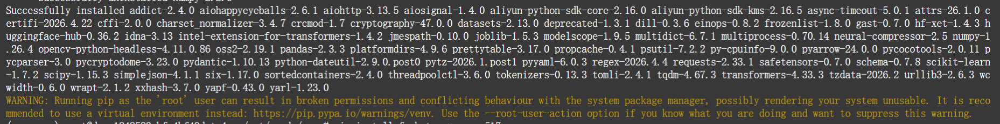

3. 安装基础依赖：

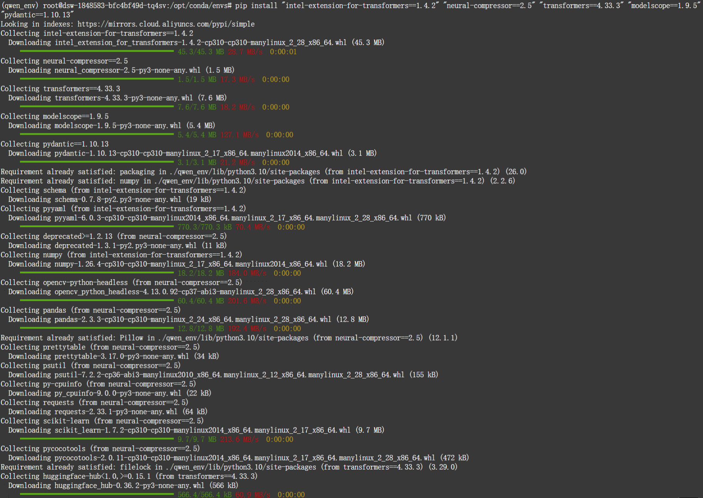

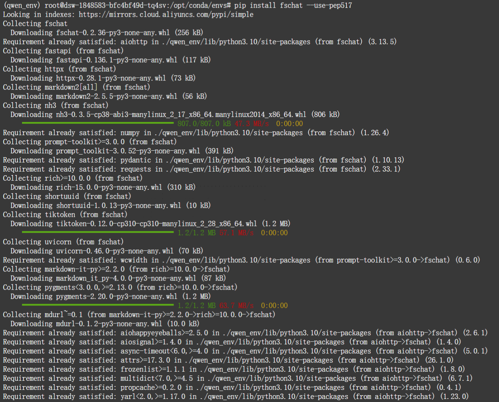

### 2.2 大模型部署

1. **通义千问 Qwen-7B-Chat**

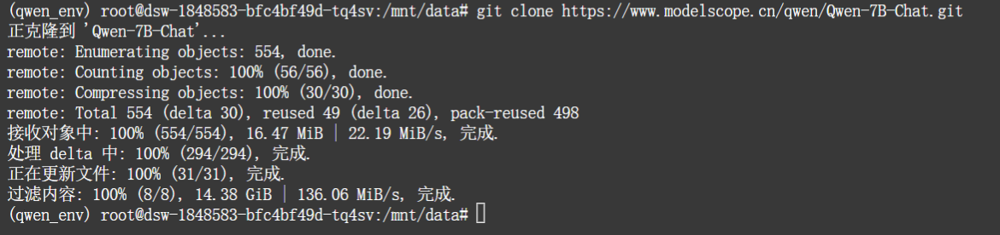

2. **智谱 ChatGLM3-6B**

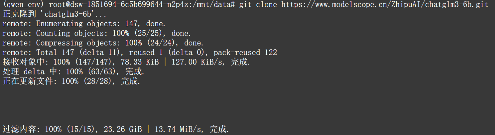

3. 百川2-7B-Chat

本实验曾尝试部署百川 Baichuan2-7B-Chat 模型，但由于模型参数量较大，运行时占用内存过高导致进程被终止，因此放弃使用该模型。

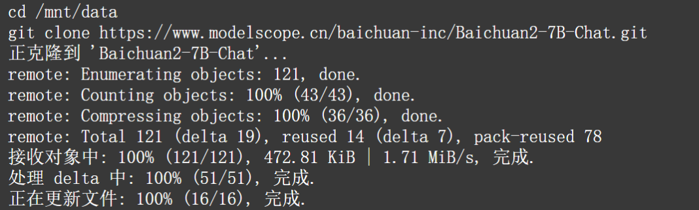

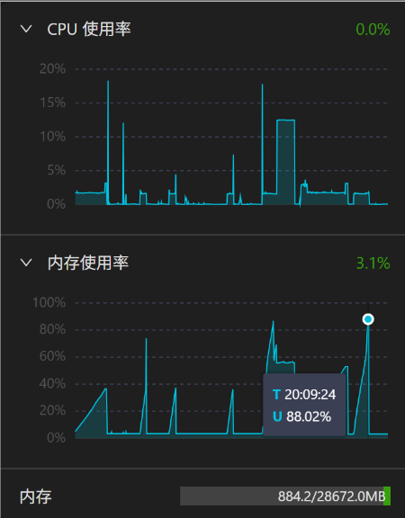

4. DeepSeek-R1-Distill-Qwen-1.5B

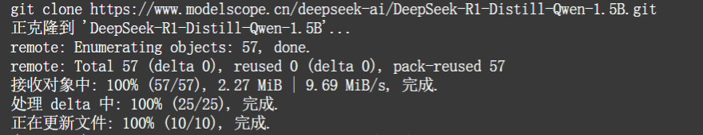

---

## 3. 问答测试与结果截图

本实验针对以下5个中文语义理解问题，分别测试三个模型并记录回答：

| 问题编号 | 问 题 内 容                                                  |
| -------- | ------------------------------------------------------------ |
| 1        | 冬天：能穿多少穿多少 / 夏天：能穿多少穿多少 — 区别在哪里？   |
| 2        | 单身狗产生的原因有两个，一是谁都看不上，二是谁都看不上 — 区别？ |
| 3        | 他知道我知道你知道他不知道吗？ — 到底谁不知道？              |
| 4        | 明明明明明白白白喜欢他，可她就是不说 — 明明和白白谁喜欢谁？  |
| 5        | 领导：你这是什么意思？ 小明：没什么意思。意思意思。 领导：你这就不够意思了。 小明：小意思，小意思。领导：你这人真有意思。 小明：其实也没有别的意思。 领导：那我就不好意思了。 小明：是我不好意思。请问：以上“意思”分别是什么意思。 |

### 3.1 通义千问 Qwen-7B-Chat

### 3.2 智谱 ChatGLM3-6B

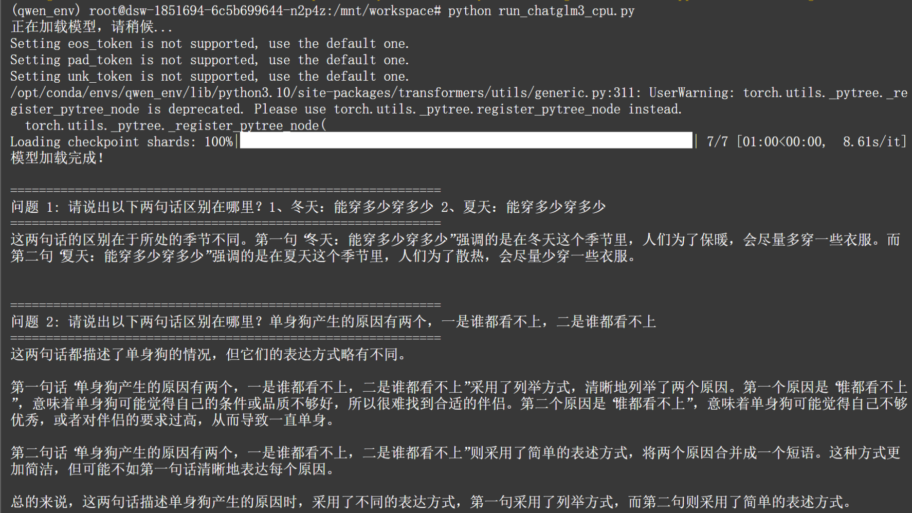

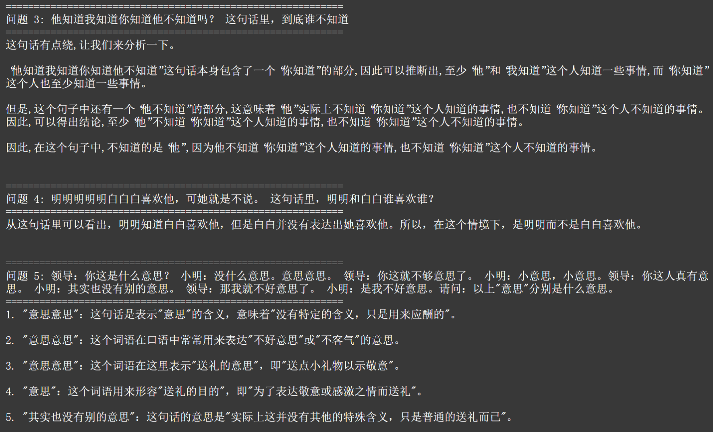

### 3.3 DeepSeek-R1-Distill-Qwen-1.5B

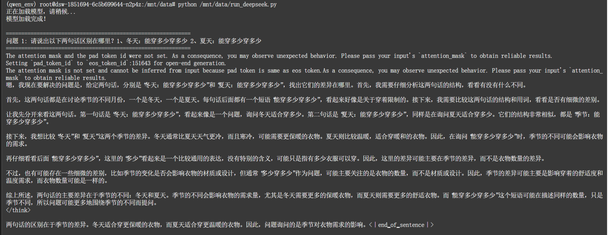

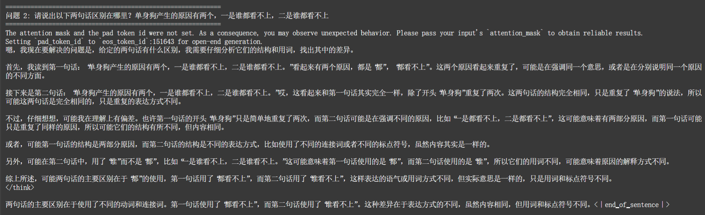

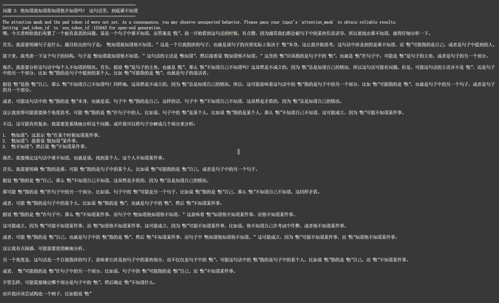

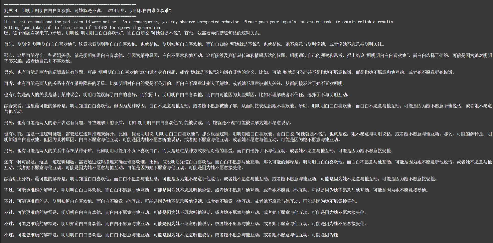

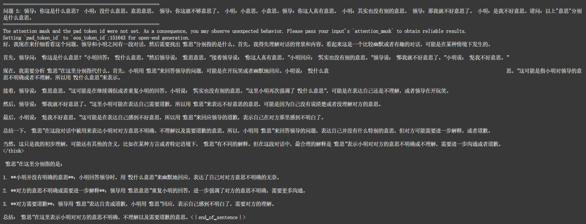

---

## 4. 大语言模型横向对比分析

### 4.1 通义千问 Qwen-7B-Chat

在本次中文歧义理解与逻辑推理测试中，Qwen-7B-Chat 的整体表现处于**中等偏下水平**，在处理中文口语歧义、多层指代嵌套及多义词语境差异等任务时存在明显不足。

在语义歧义识别方面，模型能够对部分句式进行表层解释，但对关键语义触发因素（如重音、语义指向与断句结构）把握不准确。例如，在“冬天 / 夏天能穿多少穿多少”中，模型虽提及保暖与防晒，但未能指出“多少”在不同语境中的指向差异；对于“谁都看不上”的双重歧义，则未识别主客体关系变化，而将差异简单归因为表达方式不同。

在逻辑推理与指代消解方面，模型表现出明显短板。面对多层嵌套句“他知道我知道你知道他不知道吗”，未进行有效结构拆解即判定无法回答，体现出推理链构建能力不足。在断句歧义（如“明明明明白白白喜欢他”）中，未能正确区分人名与副词结构，导致语义解析错误。此外，在多义词“意思”的对话任务中，出现输出不完整的问题，未能覆盖全部语义。

从整体来看，Qwen-7B-Chat 具备基础对话生成能力，回答结构较为规整且冗余较少，但在缺乏针对性提示优化与任务微调的情况下，其对高语境依赖与复杂逻辑结构的处理能力有限，反映出中等规模模型在细粒度语义理解与复杂推理任务中的能力瓶颈。

### 4.2 智谱 ChatGLM3-6B

ChatGLM3‑6B 作为智谱 AI 推出的轻量化对话模型，在本次测试中呈现出三者中最优的中文语言理解与逻辑推理能力，尤其在多层指代消解、口语歧义识别方面显著优于同参数量级及更小参数模型。

在歧义识别任务中，模型能够准确捕捉 “冬天 / 夏天能穿多少穿多少” 的核心歧义，区分 “尽量多穿” 与 “尽量少穿” 的语义差异，对语境驱动的歧义变化敏感度较高。不过在 “谁都看不上” 双重歧义句中未能完全理解主客体颠倒的内涵，误将差异归于表达方式区别。

在逻辑推理层面，ChatGLM3‑6B 是三款模型中唯一能够正确拆解多层嵌套问句并定位未知主体的模型，清晰追踪句子内部指代关系，得出 “他不知道” 的正确结论，展现出更强的长程依赖建模与逻辑链构建能力。在断句歧义与多义词任务中，模型虽未完全答对，但回答紧凑、推理方向合理，无大量无效重复。

整体而言，ChatGLM3‑6B 在默认调用、未进行深度参数优化的前提下，依然表现出更强的中文先验知识与对话理解能力，这与其训练数据中中文语料的分布、模型架构对中文表达的适配性高度相关。但其 对高阶歧义、文化类梗的深度理解有限，仍存在明显误判。

### 4.3 DeepSeek-R1-Distill-Qwen-1.5B

DeepSeek‑R1‑Distill‑Qwen‑1.5B 作为基于 Qwen 架构蒸馏得到的 1.5B 级小参数量模型，在本次中文歧义与逻辑推理任务中表现显著劣于 6B‑7B 量级模型，出现严重的语义误读、逻辑混乱与生成冗余问题。

在歧义识别任务中，模型几乎无法感知汉语口语中的结构性歧义，将 “冬天 / 夏天能穿多少穿多少” 的差异简单归结为季节不同，反复分析句子表层结构，完全忽略核心语义差异；对 “谁都看不上” 歧义句，模型错误认为两句话存在用词差异，并陷入无意义的循环分析，体现出极低的歧义感知能力。

在逻辑推理与指代消解任务中，模型无法拆解嵌套句式结构，大量进行自我重复、无依据推测，推理过程高度混乱，最终无法形成有效结论。在断句歧义与多义词任务中，模型同样出现严重逻辑漂移，不断重复相似表述，偏离问题核心，生成大量无效文本。

该模型的极端弱势可归因于两方面：其一，1.5B 参数量级本身难以承载复杂语义理解、逻辑推理与中文语境知识，模型容量不足以建模高阶语言歧义；其二，蒸馏过程可能丢失了基础模型的细粒度语言知识，加之直接使用默认参数调用、未经过任务适配微调、提示词优化及解码策略调整（如温度、top‑p 等），导致语义理解碎片化、逻辑一致性极差。总体而言，该类超轻量化模型在未针对性优化的条件下，难以胜任中文歧义理解与逻辑推理类任务。
